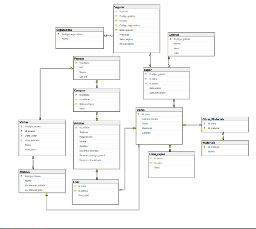

# Museum Management Database

Relational database design and implementation for a network of museums, covering artworks, artists, exhibitions, insurance and visitors. Taken from an ER diagram through normalization to a working SQL Server implementation with business-logic queries, a stored procedure and a trigger. Built for the Databases course of my BSc in Computer Engineering at UTAD.

<p align="center">
  
</p>

## 🧱 Design process

1. **ER modeling**, identifying the entities (museums, artworks, artists, people, galleries, materials, insurers) and the relationships between them (an artwork is exhibited in a gallery, insured by an insurer, made of materials, created by an artist, bought by a person, visitors check into a museum).
2. **Mapping to the relational model**, turning the ER diagram into tables, keys and foreign keys.
3. **Normalization up to 3NF**, removing partial and transitive dependencies so every non-key attribute depends on the whole key and nothing but the key.
4. **Physical implementation** in SQL Server: 14 tables, including several many-to-many relationships modeled as their own tables (`Expor`, `Segurar`, `Visitar`, `Criar`, `Comprar`, `Obras_Materiais`) since they carry their own attributes (dates, prices, hours).

## 🗄️ Schema

- **Core entities**: `Museus`, `Obras`, `Artistas`, `Pessoas`, `Galerias`, `Materiais`, `Seguradora`.
- **Relationships with attributes**: `Expor` (an artwork on display in a gallery, with start/end dates), `Segurar` (an insurance policy on an artwork), `Visitar` (a person's visit to a museum, with entry/exit times), `Criar` (artist-artwork authorship with a date), `Comprar` (a person buying an artwork), `Obras_Materiais` (the materials an artwork is made of).

## ⚙️ Business logic

Beyond the schema, `database/phase2-queries-procedures-triggers.sql` implements the actual business requirements on top of it:

- **Analytical queries**, the first artwork ever created, how many museums each person has visited, which artists had artwork bought by female buyers, which museum made the most revenue in the last 90 days, and which currently-exhibited artworks have no insurance.
- **`calcularCustoExposicao`**, a stored procedure that computes the exhibition cost for a given museum and month (€2/day per artwork on display), returning a per-museum breakdown and the grand total through an `OUTPUT` parameter.
- **`verificarCapacidadeMax`**, an `INSTEAD OF INSERT` trigger that rejects a new museum visit if it would push the museum over its maximum simultaneous-visitor capacity. It checks for actual time-interval overlap between the new visit and existing ones, not just a row count. The assignment specifies a capacity of 200, the example data in this repo tests it against a limit of 2 instead, since the sample dataset is too small to realistically reach 200 concurrent visitors, the overlap logic itself is unchanged.

## 🛠️ Tech Stack

<p align="center">
  
  
  
  
  
</p>

## 📂 Repository structure

```
database/
  phase1-schema.sql                        schema (DDL) + sample data
  phase2-queries-procedures-triggers.sql   schema + sample data + queries + procedure + trigger
assets/
  er-diagram.png
```

## 👤 About

Part of my portfolio. See my [GitHub profile](https://github.com/linho22w) for more projects in AI/ML and backend development.
